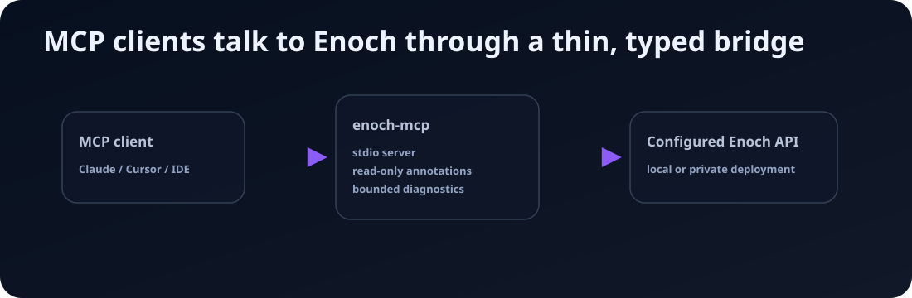

# enoch-mcp

<!-- mcp-name: io.github.alias8818/enoch -->



**`enoch-mcp` is a local Model Context Protocol stdio server for a configured Enoch FastAPI control-plane API.** It lets MCP clients inspect and operate Enoch through typed tools without exposing a raw shell or reimplementing Enoch business logic.

<p>
  <a href="https://github.com/alias8818/enoch-agentic-research-system"><strong>Enoch system repo</strong></a> ·
  <a href="https://solo-09d10f60.mintlify.app/"><strong>Docs</strong></a> ·
  <a href="https://modelcontextprotocol.io/"><strong>MCP</strong></a>
</p>

## What it does

- Registers MCP tools for Enoch control-plane, Dashboard V1, and core endpoints.
- Sends requests to a configured Enoch API URL.
- Adds `Authorization: Bearer <token>` to API requests using the configured token.
- Returns Enoch API responses to the MCP client.
- Marks read-only tools with MCP read-only annotations.
- Marks mutating tools as non-read-only and adds approval metadata.
- Keeps safe defaults for dry-run operations.
- Optionally probes configured CPU/GPU workers directly through worker APIs or allowlisted SSH diagnostics.

## What it does not do

- It does not expose a raw shell tool.
- It does not accept arbitrary SSH commands.
- It does not read or write local artifact files directly.
- It does not call language models.
- It does not cache, retry, queue, or schedule work.
- It does not bypass Enoch authentication or authorization.

## Requirements

- Python 3.11 or newer
- A running Enoch API, normally at `http://localhost:8787`
- An Enoch API bearer token
- An MCP client that can run local stdio servers

## Installation

Run from PyPI with `uvx`:

```bash
uvx enoch-mcp --api-url http://localhost:8787 --api-token '<token>'
```

Or configure with environment variables:

```bash
export ENOCH_API_URL='http://localhost:8787'
export ENOCH_API_TOKEN='<token>'
uvx enoch-mcp
```

For local development from a checkout:

```bash
git clone https://github.com/alias8818/enoch-mcp.git
cd enoch-mcp
uv sync --dev
uv run enoch-mcp --api-url http://localhost:8787 --api-token '<token>'
```

## Configuration

| Option | Environment variable | Default | Description |
| --- | --- | --- | --- |
| `--api-url` | `ENOCH_API_URL` | `http://localhost:8787` | Base URL for the Enoch API. |
| `--api-token` | `ENOCH_API_TOKEN` | none | Bearer token for the Enoch API. |
| `--worker-probes-json` | `ENOCH_WORKER_PROBES_JSON` | none | Optional JSON map for direct worker diagnostics. |
| `--worker-probes-file` | `ENOCH_WORKER_PROBES_FILE` | none | Optional path to a JSON map for direct worker diagnostics. |

The token is required. If it is missing, tool calls fail before making an HTTP request.

## Optional worker probes

Worker probes are disabled unless `ENOCH_WORKER_PROBES_JSON` or `ENOCH_WORKER_PROBES_FILE` is configured. This keeps the default package a thin control-plane bridge. When configured, the MCP exposes named diagnostics for worker truth: API health, worker-gate dashboard status, active process markers, bounded log tails, disk space, and expected artifact presence.

Example:

```json
{
  "cpu": {
    "api_url": "http://127.0.0.1:18788",
    "api_token": "worker-api-token",
    "service_name": "enoch-control-plane",
    "project_root": "/srv/enoch/projects"
  },
  "gpu": {
    "api_url": "http://127.0.0.1:18789",
    "api_token": "worker-api-token",
    "ssh_host": "worker-gpu.example.internal",
    "ssh_user": "enoch",
    "service_name": "enoch-control-plane",
    "project_root": "/srv/enoch/projects",
    "log_paths": ["/var/log/enoch-control-plane.log"]
  }
}
```

Supported fields per lane:

- `api_url`: worker-gate base URL. Used first for `/healthz`, `/dashboard/api`, `/dashboard/api/run/{run_id}`, and `/project-status/{project_id}`.
- `api_token`: worker bearer token. Treated as secret.
- `ssh_host`, `ssh_user`, `ssh_port`: optional SSH fallback/debug target.
- `service_name`: systemd unit name for service checks and journal tails.
- `project_root`, `state_dir`: fixed worker roots used for disk and artifact checks.
- `log_paths`: fixed worker-gate log paths that may be tailed.

SSH probes only run fixed diagnostic commands. They do not accept arbitrary shell input from the MCP client. User-supplied IDs are limited to safe run/project identifier characters, log output is bounded, SSH uses batch mode and no stdin, and the recommended deployment is a read-only worker user or forced-command policy.

## MCP client setup

### Claude Desktop

```json
{
  "mcpServers": {
    "enoch": {
      "command": "uvx",
      "args": ["enoch-mcp"],
      "env": {
        "ENOCH_API_URL": "http://localhost:8787",
        "ENOCH_API_TOKEN": "replace-with-token"
      }
    }
  }
}
```

For local development, point the MCP client at the checkout:

```json
{
  "mcpServers": {
    "enoch": {
      "command": "uv",
      "args": ["--directory", "/path/to/enoch-mcp", "run", "enoch-mcp"],
      "env": {
        "ENOCH_API_URL": "http://localhost:8787",
        "ENOCH_API_TOKEN": "replace-with-token"
      }
    }
  }
}
```

Use the equivalent local stdio-server settings for Cursor, Copilot, Windsurf, or other MCP clients.

## Development

```bash
uv sync --dev
uv run pytest -q
gitleaks detect --no-git --redact
```

## Public-safety note

This package is public. Examples must use placeholders and local URLs only. Do not publish private hostnames, LAN/Tailscale IPs, operator paths, or live tokens.
